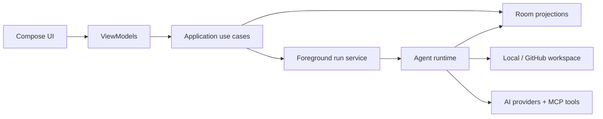

# Varen

<p align="center">
  <strong>A project-first AI coding workspace that fits in your pocket.</strong>
</p>

<p align="center">
  Build, inspect, and supervise durable agent runs directly from Android—with real workspaces, explicit trust controls, and local usage analytics.
</p>

<p align="center">
  
  
  
  
  
</p>

---

Varen treats an AI coding session as durable project work—not a disposable chat. Projects, tasks, approvals, run events, checkpoints, diffs, history, and usage records are persisted so execution can be paused, recovered, inspected, and trusted.

## Why Varen?

- **Project-first workflow** — agents work inside a selected local or GitHub workspace.
- **Durable execution** — foreground runs, leases, heartbeats, and process-death recovery keep state coherent.
- **Human control** — trust modes, approvals, pause/resume/cancel controls, checkpoints, and diffs keep changes reviewable.
- **Provider freedom** — configurable connections and model selection across compatible AI providers.
- **Usage clarity** — understand where tokens go without sending analytics to another dashboard.
- **Honest readiness** — every run snapshots its workspace capabilities and reports verification limits explicitly.

## Usage that is actually useful

The Usage panel borrows the best information hierarchy from [9Router](https://github.com/decolua/9router) and adapts it to Varen's monochrome mobile interface.

| Signal | What it answers |
| --- | --- |
| **Today / 7D / 30D / All** | How usage changes across meaningful time windows |
| **Token overview** | Total input, output, and cached tokens for the selected period |
| **Activity trend** | When token consumption rises or falls |
| **Usage by model** | Which models consume the most tokens and requests |
| **Recent requests** | What ran, when it ran, and how much work it performed |

All figures come from persisted local run records. Varen intentionally avoids invented cost or quota estimates when a trustworthy source is not available.

## Core capabilities

- Project- and task-centered agent workflow
- Configurable AI connections and model catalog
- Local Storage Access Framework and GitHub workspace execution
- Preflight readiness checks for project access, connection auth, model availability, and runtime support
- Room-backed runs, messages, events, approvals, leases, and usage
- Foreground execution with pause, resume, and cancel controls
- Recovery after process death with uncertain side-effect protection
- Checkpoints, diffs, history, usage analytics, and trust modes
- MCP-powered external tool integration
- Minimal monochrome UI designed for focused mobile work

## Workspace capability boundaries

Varen only advertises tools that the selected workspace can actually execute. The capability snapshot is persisted with each run, so a later configuration change cannot silently broaden an in-flight run.

| Capability | Local SAF workspace | GitHub workspace |
| --- | --- | --- |
| Read, search, and edit files | Yes | Yes |
| Checkpoints and local diffs | Yes | Not currently |
| Local shell commands | No | No |
| Verification | Reported as not command-verified | Remote APK build after agent completion |

Task completion and verification are separate signals in the task timeline. Varen does not label a local SAF result as build-verified when Android has no command execution adapter for that workspace.

## Credential and backup security

Connection credentials are encrypted with an Android Keystore AES-GCM key and stored outside the Room database. On startup, legacy plaintext connection fields are migrated with a write-verify-replace sequence; plaintext is retained for retry if encrypted readback or the database marker update fails.

Room databases and encrypted credential preferences are excluded from Android cloud backup and device-to-device transfer. This avoids restoring encrypted payloads without their non-exportable Keystore key and prevents agent history or workspace metadata from being copied implicitly.

## How it fits together



The UI observes persisted Room projections and sends commands through application use cases. Agent execution is owned by a foreground service and supervised through durable run state, leases, and heartbeats. Workspace engines sit behind compatibility boundaries so local and remote execution can evolve independently.

## Quick start

### Requirements

- Android Studio with Android SDK 35
- JDK 17
- Android 8.0 / API 26 or newer for the target device

### Build and verify

From the repository root:

```powershell
.\gradlew.bat testDebugUnitTest compileDebugAndroidTestKotlin assembleDebug lintDebug assembleRelease
```

The debug APK is generated at:

```text
app/build/outputs/apk/debug/app-debug.apk
```

The same release gate runs in [GitHub Actions](.github/workflows/android-release-gate.yml) for pull requests and pushes to `main`.

Install it on a connected device with:

```powershell
adb install -r app/build/outputs/apk/debug/app-debug.apk
```

## Project map

| Area | Location |
| --- | --- |
| Compose screens and shell | `app/src/main/java/com/agentworkspace` |
| Durable runtime | `app/src/main/java/com/agentworkspace/runtime` |
| Local persistence | `app/src/main/java/com/agentworkspace/data` |
| Usage analytics | `app/src/main/java/com/agentworkspace/usage` |
| Unit tests | `app/src/test/java/com/agentworkspace` |
| Room schemas | `app/schemas` |
| CI release gate | `.github/workflows/android-release-gate.yml` |

## Project status

Varen is under active development. The architecture favors correctness, recoverability, and inspectability over hidden automation. Interfaces may still evolve, so review migrations and run the full verification command before shipping a build.

## Contributing

Contributions are welcome—especially focused fixes, provider compatibility improvements, test coverage, accessibility work, and performance improvements.

1. Fork the repository and create a focused branch.
2. Keep changes small enough to review and include tests for behavior changes.
3. Run the full verification command above.
4. Open a pull request explaining the problem, the approach, and any trade-offs.

Please avoid committing credentials, `local.properties`, generated build output, logs, or private workspace data.

## Repository hygiene

Generated build output, local SDK configuration, credentials, logs, analysis graphs, and internal planning artifacts are intentionally excluded from version control.
